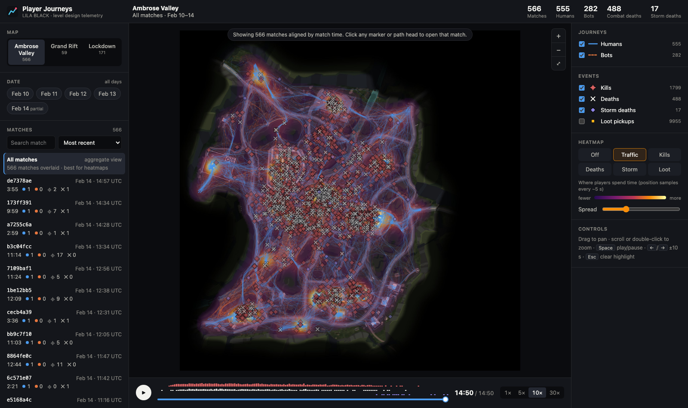
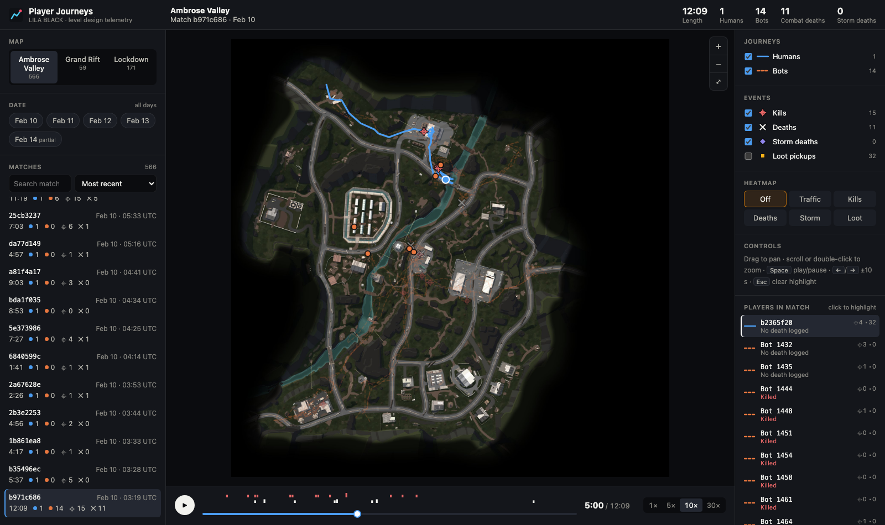

# LILA BLACK — Player Journey Visualizer

A browser tool for level designers. It shows how players move, fight, loot and die on LILA BLACK's three maps, using 5 days of production telemetry.

**Live:** https://sanskriti2004.github.io/player-journey-visualizer/



## What it does

| Need | How |
|---|---|
| See journeys on the right map | Every path is drawn on its minimap using the documented world→minimap transform (see [ARCHITECTURE.md](ARCHITECTURE.md#coordinate-mapping)). Drag to pan; scroll or double-click to zoom. |
| Humans vs bots | Humans are **solid blue** lines, bots **dashed orange**. Each can be toggled, with counts. |
| Event markers | Kills (red crosshair), deaths (white ✕), storm deaths (violet ◆) and loot (gold ■). Each has its own shape and colour, so they read even for colour-blind viewers. Hover for details. |
| Filters | Map, date (multi-select; Feb 14 marked partial) and match. Matches can be searched and sorted (most recent, longest, most kills or deaths, most bots). |
| Playback | Play/pause, 1–30× speed and a scrubber. A strip above the scrubber shows when kills, deaths and storm deaths happen. Works for one match, or for *all* filtered matches aligned by match time. |
| Heatmaps | Traffic, kills, deaths, storm deaths and loot, computed for the current filter. Adjustable spread. |
| Drill-down | In the all-matches view, clicking any marker opens that match with the player highlighted. In a match, clicking a player (on the map or in the list) highlights their journey. |
| Shareable views | Map, dates, match and heatmap are stored in the URL, so a link reopens the same view. |



## Quick start

Requirements: Node 20+. Python 3.10+ is needed only to rebuild the data.

```bash
npm install
npm run dev          # http://localhost:5173
```

The processed data (`public/data`, `public/minimaps`) is committed, so the app runs without the raw dataset.

### Rebuilding the data from `player_data.zip`

```bash
unzip player_data.zip -d data_raw          # → data_raw/player_data/February_10/…
python3 -m venv .venv && .venv/bin/pip install -r pipeline/requirements.txt
.venv/bin/python pipeline/build_data.py    # or: build_data.py /path/to/player_data
```

The script checks the README's coordinate example and prints data-quality stats: rows, dropped duplicates, out-of-range points, cross-day matches and ID anomalies.

### Tests

```bash
npm test                                   # unit: coordinate mapping, playback interpolation, heatmap
npx playwright install chromium
npx playwright test                        # E2E against a local production build
BASE_URL=https://sanskriti2004.github.io/player-journey-visualizer/ npx playwright test   # E2E against the live site
```

### Deploy

Every push to `main` runs the tests, builds, and publishes `dist/` to GitHub Pages (`.github/workflows/deploy.yml`). The app is fully static, so any static host works: `npm run build`, then serve `dist/`.

**Environment variables:** none.

## Project layout

```
pipeline/build_data.py     parquet → compact JSON + resized minimaps
public/data/               manifest.json + one JSON per map (generated)
src/App.tsx                state, filters, URL sync
src/components/            MapCanvas (render + interaction), Timeline, Sidebar, LayerPanel
src/lib/                   coords, heatmap, playback, events, data loading, URL state
e2e/                       Playwright tests
```

## Docs

- [ARCHITECTURE.md](ARCHITECTURE.md): stack, data flow, coordinate mapping, assumptions, trade-offs
- [INSIGHTS.md](INSIGHTS.md): three findings about the maps, with evidence and recommended actions
